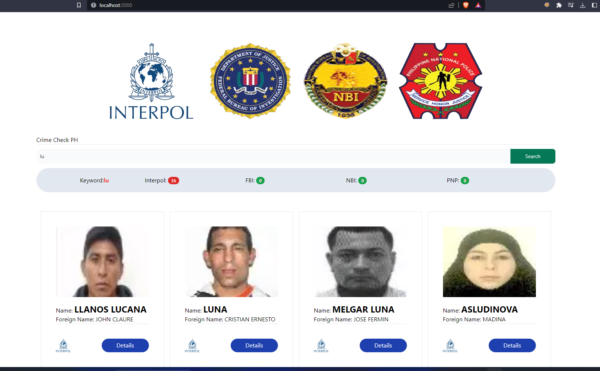

# Person Integrity Check PH
### Status: Under development
<p>See below the screenshot and short clip of the initial design and functionality.</p>


<video width="100%" height="240" controls>
  <source src="docs/videos/video.mp4" type="video/mp4">
</video>
In this clip, It only consumes the API of interpol, still working on other agencies.

## About 
<b>Person Integrity Check PH</b> is a web application that consumes API from law enforcement agencies such as Interpol and the FBI. In the Initial plan, it was also supposed to get data from PNP and NBI. But unfortunately, there are no available APIs from the two agencies.

I came up with this idea while I was watching The Blacklist(TV Series), There was a scene where an FBI agent is searching records of a person and It shows on a CGI computer screen that the fictional system is searching records from a different agency such as CIA, NSA, and FBI.

So I thought, What if we have a system like that, accessible publicly where people can look up criminal records of someone (a New neighbor, tenant, employee, potential lover, or a person you just met)?
## Built with
<ul>
    <li>Next 13</li>
    <li>Tailwind</li>
    <li>Zustand</li>
</ul>

## Getting Started

### Installation
1. Clone the repo
```sh
git clone repository.git
```
2. Navigate to the project folder
```sh
cd project-folder/
```
3. run this command on the terminal
``` sh
npm run dev
```

## API
<ul>
    <li><code>https://api.fbi.gov/docs#!/Wanted/get_wanted</code></li>
    <li><code>https://ws-public.interpol.int/notices/v1/
</code></li>
</ul> 

## License

